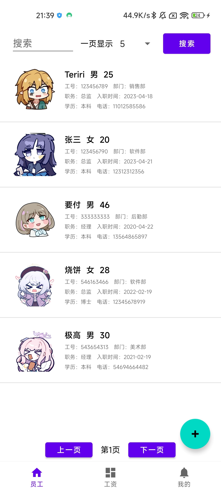
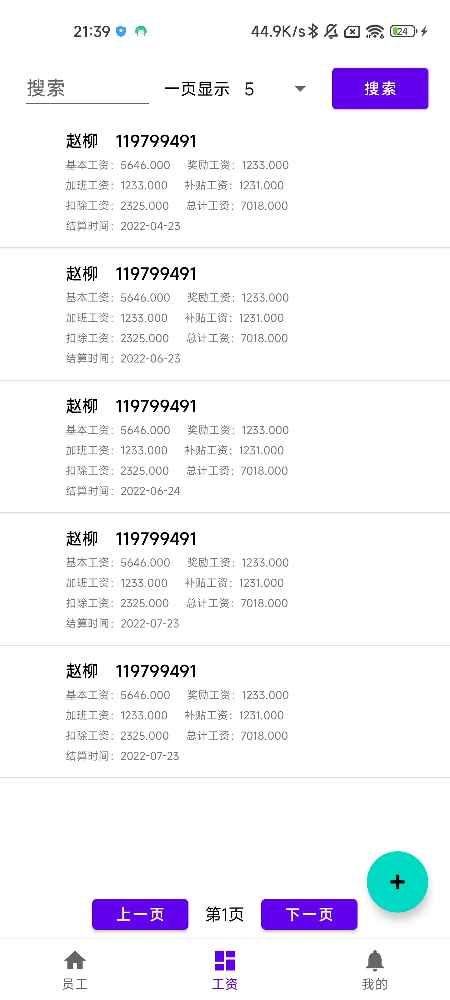
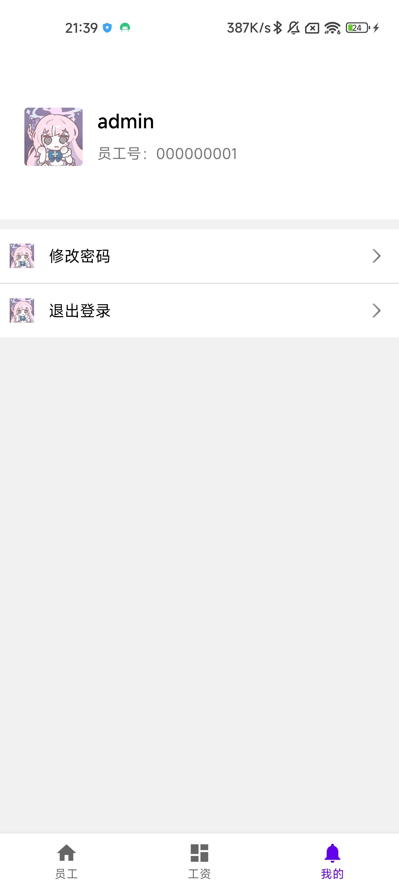
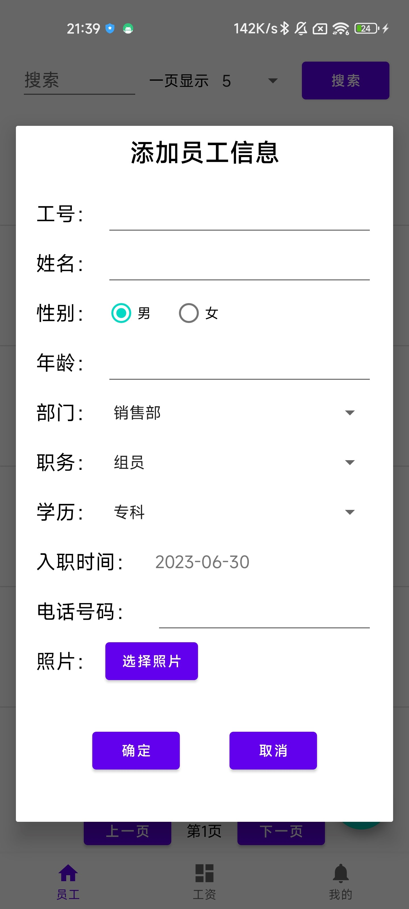
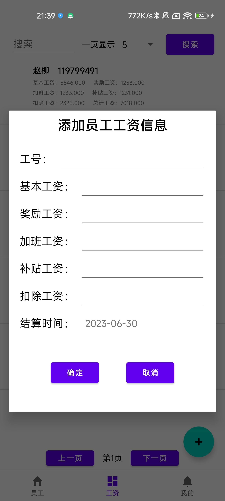
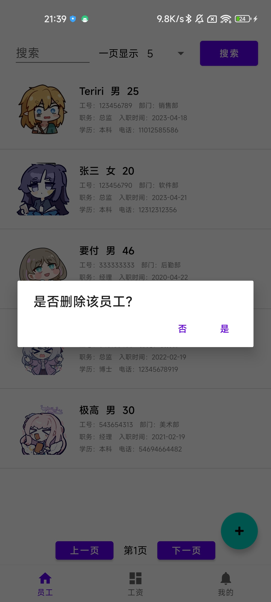

# 员工信息管理App（Employee-Manage-App）

## 项目说明

这是一个Android项目，采用前后端分离，实现员工信息管理的基本功能，比如：

* 用户登录
* 账号信息管理
* 员工信息管理
* 员工工资信息管理
* ...

项目已经完结

## 使用的框架

* Android
* FastJSON
* 传统Servlet Web（当时还没学会Spring（笑））
* ...

## 界面展示
* 登录界面

登录界面（未输入信息、账号存在）

* 管理员界面

管理员管理界面（员工信息、工资信息显示）

* 管理员管理界面

管理员管理界面（添加员工信息、工资信息、删除员工信息）

## 关键代码
### 与JavaWeb服务器交互
* 在本App当中，Android程序充当显示界面的作用，而实际的相应逻辑控制、数据访问则是交给Tomcat服务器。所以在这里需要完成Android程序与Servlet的数据交互问题。在这里使用了Android自带的HttpPost、DefaultHttpClient、HttpResponse等类，完成与Tomcat服务器完成数据交互，交互采用post传值。在这里编写了一个工具类完成上述功能的实现，代码如下：
~~~Java
public class ServerUtils {
    private static final String url = "http://172.20.10.3/server";

    public static String executeUrl(String servletPath, List<NameValuePair> list) throws IOException {
        HttpPost httpPost = new HttpPost(url + servletPath);
        httpPost.setEntity(new UrlEncodedFormEntity(list, HTTP.UTF_8));
        HttpResponse response = new DefaultHttpClient().execute(httpPost);
        return EntityUtils.toString(response.getEntity(), "UTF-8");
    }
}
~~~

### 图片的处理
* 在传输照片时，采用Base64加密使得Bitmap对象转化为String对象，当需要显示时，再由String对象转化为Bitmap对象完成显示，相应功能代码如下：
~~~Java
public class ServerUtils {
    @RequiresApi(api = Build.VERSION_CODES.O)
    public static Bitmap decodeImageString(String imageString) {
        byte[] bytes = Base64.getMimeDecoder().decode(imageString);
        return BitmapFactory.decodeByteArray(bytes, 0, bytes.length);
    }

    @RequiresApi(api = Build.VERSION_CODES.O)
    public static String encodeImageBitmap(Bitmap bitmap) {
        String imageString = "";
        ByteArrayOutputStream out = new ByteArrayOutputStream();
        bitmap.compress(Bitmap.CompressFormat.JPEG, 100, out);
        imageString = Base64.getEncoder().encodeToString(out.toByteArray());
        return imageString;
    }
}
~~~

### 图片的获取
* 图片的获取则是使用Intent启动Android的图库，用户选中后会返回对应图片的Bitmap。
  在本项目，由于是在Dialog当中启动该Intent，所以需要保存一下主Activity对象，交由主Activity对象执行Intent。
  所以在一个线程当中等待用户选中图片，选中后通过Activity对象获取Bitmap对象，然后按规则处理即可。
  （这样写是有点不妥，耦合太强了，应该有更好的解决方法）
~~~Java
//自定义Dialog代码
public class EmployeeDialog extends Dialog implements View.OnClickListener {
    //...
    private void imageButton() {
        Intent intent = new Intent(Intent.ACTION_PICK, MediaStore.Images.Media.EXTERNAL_CONTENT_URI);
        intent.setDataAndType(MediaStore.Images.Media.EXTERNAL_CONTENT_URI, "image/*");
        activity.startActivityForResult(intent, 1);
        new Thread(new Runnable() {
            @Override
            public void run() {
                while (true) {
                    //实时判定Activity有没有获得图片
                    if (activity.getBitmap() == null) {
                        try {
                            Thread.sleep(400);
                        } catch (InterruptedException e) {
                            throw new RuntimeException(e);
                        }
                    } else {//获取到图片后，显示在Dialog上
                        activity.runOnUiThread(new Runnable() {
                            @Override
                            public void run() {
                                bitmap = activity.getBitmap();
                                imageView.setImageBitmap(bitmap);
                                activity.setBitmap(null);
                            }
                        });
                        break;
                    }
                }
            }
        }).start();
    }
    //...
}
~~~

~~~Java
//主Activity需实现onActivityResult()
public class MainActivity extends AppCompatActivity {
    //...
    @Override
    protected void onActivityResult(int requestCode, int resultCode, @Nullable Intent data) {
        super.onActivityResult(requestCode, resultCode, data);
        if (requestCode == 1 && data != null) {
            try {
                Uri imageUri = data.getData();
                bitmap = BitmapFactory.decodeStream(getContentResolver().openInputStream(imageUri));
            } catch (FileNotFoundException e) {
                throw new RuntimeException(e);
            }
        }
    }

    public Bitmap getBitmap() {
        return bitmap;
    }

    public void setBitmap(Bitmap bitmap) {
        this.bitmap = bitmap;
    }
    //...
}
~~~

### Servlet的简化
* 因为用的是Servlet，按照传统的来，估计是一个url对应一个Servlet，估计得写死，所以这里用反射，实现类似Spring的@RequerMapper()的一个效果。
  这样的话，url=当中的'*'就必须是该Servlet函数的名称。
  比如url="/EmployeeServlet/findAll"，那么那个函数也必须叫findAll
~~~Java
@WebServlet(name = "EmployeeServlet", value = "/EmployeeServlet/*")
public class EmployeeServlet extends HttpServlet {
    @Override
    protected void service(HttpServletRequest req, HttpServletResponse resp) throws ServletException, IOException {
        resp.setCharacterEncoding("UTF-8");
        String uri = req.getRequestURI();
        String methodName = uri.substring(uri.lastIndexOf("/") + 1);//获取url当中的方法名称
        try {
            Method method = this.getClass().getMethod(methodName, HttpServletRequest.class, HttpServletResponse.class);
            method.invoke(this, req, resp);
        } catch (NoSuchMethodException | IllegalAccessException | InvocationTargetException e) {
            throw new RuntimeException(e);
        }
    }
    //执行的方法...
}
~~~

### 自定义ListView
* 继承BaseAdapter，自己实现即可，在自定义的BaseAdapter当中完成对ListView界面xml文件的处理
~~~Java
public class EmployeeAdapter extends BaseAdapter {
    private Context context;
    List<Employee> employees;

    public EmployeeAdapter(Context context, List<Employee> employees) {
        this.context = context;
        this.employees = employees;
    }

    @Override
    public int getCount() {
        return employees.size();
    }

    @Override
    public Object getItem(int position) {
        return employees.get(position);
    }

    @Override
    public long getItemId(int position) {
        return position;
    }

    @RequiresApi(api = Build.VERSION_CODES.O)
    @Override
    public View getView(int position, View convertView, ViewGroup parent) {
        convertView = LayoutInflater.from(context).inflate(R.layout.employee_item, parent, false);
        //findViewById()找到对应组件，根据position可以找到对应员工信息，初始化组件即可
        TextView ename = convertView.findViewById(R.id.ename);
        Employee employee = employees.get(position);
        ename.setText(employee.getEname());
        //...其他省略
        return convertView;
    }
}
~~~
* 使用如下：
~~~Java
public class EmployeeFragment extends Fragment implements View.OnClickListener, AdapterView.OnItemClickListener, AdapterView.OnItemLongClickListener {
    public View onCreateView(@NonNull LayoutInflater inflater, ViewGroup container, Bundle savedInstanceState) {
        View view = inflater.inflate(R.layout.fragment_employee, container, false);
        //完成界面初始化...
        displayListView();
        return view;
    }
    
    public void displayListView() {
        new Thread(new Runnable() {
            @Override
            public void run() {
                //Network相关操作必须开线程
                List<NameValuePair> list = new ArrayList<>();
                if (user.getFlag() == 0) {
                    list.add(new BasicNameValuePair("eno", searchEditText.getText().toString()));
                    list.add(new BasicNameValuePair("page", String.valueOf(page)));
                    list.add(new BasicNameValuePair("count", (String) countSpinner.getSelectedItem()));
                } else {
                    list.add(new BasicNameValuePair("eno", user.getEno()));
                    list.add(new BasicNameValuePair("page", "1"));
                    list.add(new BasicNameValuePair("count", "1"));
                }
                try {
                    String json = ServerUtils.executeUrl("/EmployeeServlet/selectEmployeeByLimit", list);
                    List<Employee> data = JSON.parseArray(json, Employee.class);
                    String count = ServerUtils.executeUrl("/EmployeeServlet/getSelectEmployeeCount", list);
                    maxPage = Integer.parseInt(count) / Integer.parseInt((String) countSpinner.getSelectedItem()) + 1;
                    getActivity().runOnUiThread(new Runnable() {
                        @Override
                        public void run() {
                            //有关UI操作必须回到主Activity的线程进行
                            EmployeeAdapter adapter = new EmployeeAdapter(getContext(), data);
                            listView.setAdapter(adapter);//设置自定义Adapter
                        }
                    });
                } catch (IOException e) {
                    throw new RuntimeException(e);
                }
            }
        }).start();
    }
    
    //其他方法...
}
~~~

### SQL工具
* 这里没使用Mybatis（当时还不会），所以自己搓了一个Utils，帮助执行SQL，用到Java反射。
  其实就是根据SQL查询后的结果集的MetaData，根据这个MetaData可以得到查询表头，在根据这个查询表头用反射填充属性字段就行了。
  （后续还添加了执行存储过程的方法）
~~~Java
public class JdbcUtils {
    private static final String url = "jdbc:mysql://localhost:3306/android_class_design?useUnicode=true&characterEncoding=utf-8&useSSL=false&serverTimezone=GMT%2B8";
    private static final String user = "root";
    private static final String password = "root";
    private static Connection connection = null;

    static {
        try {
            Class.forName("com.mysql.cj.jdbc.Driver");
        } catch (ClassNotFoundException e) {
            throw new RuntimeException(e);
        }
    }

    private static synchronized Connection getConnection() throws SQLException {
        if (connection == null) {
            connection = DriverManager.getConnection(url, user, password);
        }
        return connection;
    }

    public static int add(String sql, Object... var) {
        return modify(sql, var);
    }

    public static int delete(String sql, Object... var) {
        return modify(sql, var);
    }

    public static int update(String sql, Object... var) {
        return modify(sql, var);
    }

    public static <T> ArrayList<T> search(String sql, Class<T> cls, Object... var) {
        ArrayList<T> list = new ArrayList<>();
        try {
            PreparedStatement prep = getConnection().prepareStatement(sql);
            ArrayList<Field> fields = new ArrayList<>();
            for (int i = 0; i < var.length; i++) {
                prep.setObject(i + 1, var[i]);
            }
            ResultSet resultSet = prep.executeQuery();
            ResultSetMetaData metaData = resultSet.getMetaData();
            //根据sql执行结果，获取cls当中属性字段field
            for (int i = 1; i <= metaData.getColumnCount(); i++) {
                //System.out.println("ColumnLabel:"+metaData.getColumnLabel(i)+ " ColumnName:"+metaData.getColumnName(i));
                try {
                    //System.out.println(cls.getDeclaredField(metaData.getColumnLabel(i).toLowerCase()));
                    fields.add(cls.getDeclaredField(metaData.getColumnLabel(i)));
                } catch (NoSuchFieldException ignored) {}
            }
            while (resultSet.next()) {
                T instance = null;
                //基本类型处理
                if (cls.isAssignableFrom(Integer.class)
                        || cls.isAssignableFrom(Long.class)
                        || cls.isAssignableFrom(Double.class)
                        || cls.isAssignableFrom(String.class)) {
                    instance = (T) resultSet.getObject(1);
                } else if (cls.isAssignableFrom(Boolean.class)) {
                    long v = resultSet.getLong(1);
                    Boolean val = v > 0;
                    instance = (T) val;
                } else {
                    instance = cls.newInstance();//创建cls对应的实例
                    for (Field field : fields) {
                        field.setAccessible(true);//属性字段为private，需设置可见性为true才能调用field的set方法
                        field.set(instance, resultSet.getObject(field.getName()));//设置实例属性字段的值
                    }
                }
                list.add(instance);
            }
            prep.close();
        } catch (SQLException | InstantiationException | IllegalAccessException e) {
            throw new RuntimeException(e);
        }
        return list;
    }
    
    public static <T> T searchOne(String sql, Class<T> cls, Object... var) {
        return search(sql,cls,var).get(0);
    }
    
    private static int modify(String sql, Object... var) {
        int modify=0;
        try {
            PreparedStatement prep = getConnection().prepareStatement(sql);
            for (int i = 0; i < var.length; i++) {
                prep.setObject(i + 1, var[i]);
            }
            modify= prep.executeUpdate();
            prep.close();
        } catch (SQLException e) {
            throw new RuntimeException(e);
        }
        return modify;
    }

}
~~~